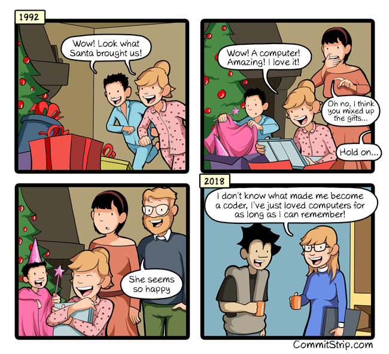
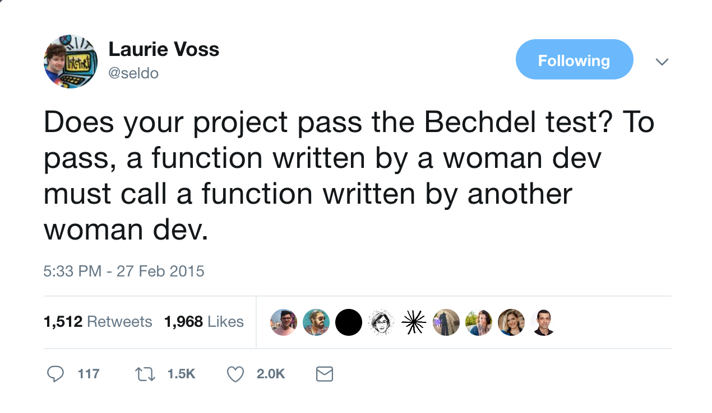

# Web sites / blogs

- [Geek Feminism Wiki](http://geekfeminism.wikia.com/wiki/Geek_Feminism_Wiki)
- [The Everyday Sexism Project](https://everydaysexism.com/)
- [Fat, Ugly, or Slutty](http://fatuglyorslutty.com/)
- [You May Have Seen My Face on BART](https://medium.com/the-coffeelicious/you-may-have-seen-my-face-on-bart-8b9561003e0f)
- [Sexist Reactions To An Ad Spark #ILookLikeAnEngineer Campaign](https://www.npr.org/sections/thetwo-way/2015/08/04/429362127/sexist-reactions-to-an-ad-spark-ilooklikeanengineer-campaign?t=1550840324970)
- [The Story of Why I Left Riot Games](http://barryhawkins.com/blog/posts/the-story-of-why-i-left-riot-games/)
- [What Happened When A Man Signed Work Emails Using A Female Name For 2 Weeks](https://www.huffingtonpost.co.uk/entry/what-happened-when-a-man-signed-work-emails-using-a-female-name-for-a-week_us_58c2ce53e4b054a0ea6a4066?guccounter=1&guce_referrer_us=aHR0cHM6Ly93d3cuZ29vZ2xlLmNvbS8&guce_referrer_cs=3AUyWoVMKjxo7IE7C1FZXw)
- [These Women Entrepreneurs Created A Fake Male Cofounder To Dodge Startup Sexism](https://www.fastcompany.com/40456604/these-women-entrepreneurs-created-a-fake-male-cofounder-to-dodge-startup-sexism)
- [Christmas Present Mix-up](http://www.commitstrip.com/en/2018/01/02/christmas-present-mix-up/)
- 

## Thoughtful Articles On Why Diversity Initiatives Aren't Sexist/Racist

- [How I Stopped Worrying and Started Loving PyLadies](https://hynek.me/articles/how-i-stopped-worrying-and-started-loving-pyladies/)
- [Why Django Girls?](https://medium.com/humanist-voices/why-django-girls-fd7e9f1ea77c)
- [Why People of Color Need Spaces Without White People](https://arrow-journal.org/why-people-of-color-need-spaces-without-white-people/)

## On Dating and Boundaries

- [Why Do Men Keep Putting Me in the Girlfriend-Zone?](http://literaryreference.tumblr.com/post/50677204942/why-do-men-keep-putting-me-in-the-girlfriend-zone)
- [Tumblr Thread on Women and 'being friends'](https://imgur.com/a/TbS88)

## On Household Roles

- [What Is Emotional Labor, and How Does it Affect Your Marriage?](https://www.fatherly.com/love-money/emotional-labor-marriage-care/)

## Fabulous Tweets

[link to tweet](https://twitter.com/seldo/status/571453200093437952)

## Hashtags

- [#Ilooklikeanengineer](https://twitter.com/search?vertical=default&q=%23Ilooklikeanengineer&src=typd)
- [#blackwomenatwork](https://twitter.com/search?q=%23blackwomenatwork&src=typd)
- [#blackwomenintech](https://twitter.com/hashtag/blackwomenintech?src=hash)

